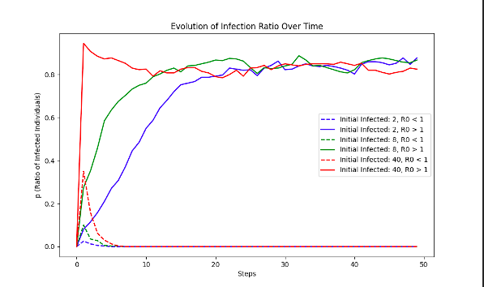
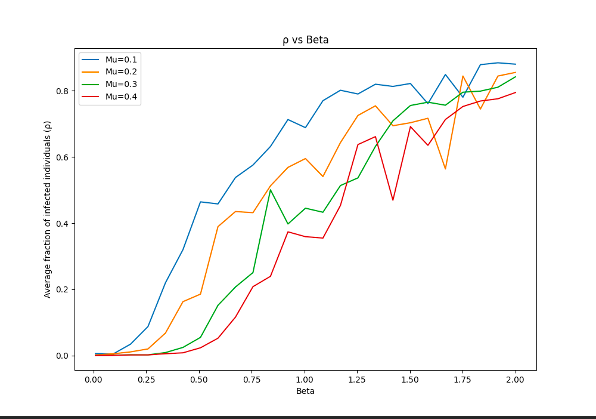
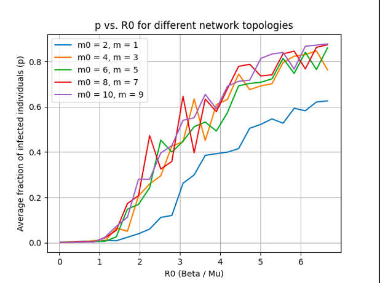

# Network Dynamics Microscopic Markov Chains and Monte Carlo Simulations
This project simulates the spread of infections in a network replicating 
the SIS (Susceptible-Infected-Susceptible) model. It uses the 
Barabasi-Albert (BA) model to manually generate scale-free networks and 
analyzes the dynamics of disease spread over time. 

## Authors
**Nicolau San Millán, Sander Rannik, Yago Granada, Riccardo Orsini and 
Rodrigo Sastré**

## Table of Contents
-[Installation](#installation)
-[Usage](#usage)
-[Project Structure](#project-structure)
-[License](#license)

## Installation
**Prerequisites:**

- Python 3.x
- pip

**Steps:**

1. Clone the repository. 
```bash
git clone 
https://https://https://github.com/roodriigoooo/Network-Dynamics-Microscopic-Markov-Chains-and-MonteCarlo-Simulations
```

2. Navigate to the project directory:
```bash
cd Network-Dynamics-Microscopic-Markov-Chain-and-MonteCarlo-Simulations
```

3. (Optional but recommended) Create a virtual environment.
```bash
python -m venv venv
```

4. Activate the virtual environment.
- On windows:
```bash
venv\Scripts\activate
```
- On macOS/Linux:
```bash
source venv/bin/activate
```

5. Install the required packages.
```bash
pip install -r requirements.txt
```

## Usage

Run the main script to start the simulation:

```bash
python main.py
```

The program will generate network graphs and plots showing the spread of 
infection over time. Note: Ensure that you have all dependencies installed 
and that the virtual environment, if using one, is activated. 

## Project Structure
```bash
Network-Dynamics-Microscopic-Markov-Chains-and-MonteCarlo-Simulations/
|--main.py
|--src/
   |--__init__.py
   |--evolution_utils.py
   |--graph_utils.py
   |--authors_prep.py
```

- **main.py**: Entry point of the application. 
- **src/**: Contains the source code modules. 
	- **authors_prep.py**: Functions for plotting and printing 
matrices. 
	- **evolution_utils.py**: Functions for simulating the SIS model. 
	- **graph_utils.py**: Functions for generating and manipulating 
networks. 

## Description of Visualizations

**Infection ratio over time:**



The displays the evolution of the ratio of infected individuals over time (steps) for varying initial infected sizes and values of the basic reproduction number (R0, which is beta over mu). Each line on the graph represents a distinct combination of initial infected size and R0 value, allowing for a comparative analysis of how different parameters influence the progression of the spread. For instance, higher initial infected sizes or larger R0 (that is beta larger than mu) values lead to faster and more extensive outbreaks, whereas lower values of these parameters result in slower patterns. 

**Evolution of Infection ratio vs. Infection rate:**


The visualization depicts the relationship between the infection rate (beta) and the average fraction of infected individuals (ρ) while keeping the recovery rate (mu) fixed. Each line on the graph represents a distinct value of the recovery rate (mu), allowing for a comparative analysis of how different values of mu influence the impact of changes in the infection rate on the spread of the disease. Higher infection rates and lower recovery reates lead to a more rapid increase in the fraction of infected individuals, resulting in larger outbreaks and potentially more severe epidemics. 

**Infection ratio vs. Basic reproduction number:**


The graph shows how the basic reproduction number (R0) affects the average fraction of infected individuals across different network setups depending on the configuration of the parameters of the Barabasi-Albert model: Initial network size (m0, which determines the number of nodes in the initial fully connected network before new nodes are added, a higher m0 value results in a larger initial network size); and Number of edges added for each new node (m, which specifies the number of edges that new nodes form with existing nodes when they are added to the network, higher values of m lead to networks with denser connectivity). Each line represents a unique network structure, and by examining this graph, we can see how less connected networks manage to contain more the spread. 

## License
This project is licensed under the MIT license - see the [LICENSE](LICENSE.txt) file for details.
